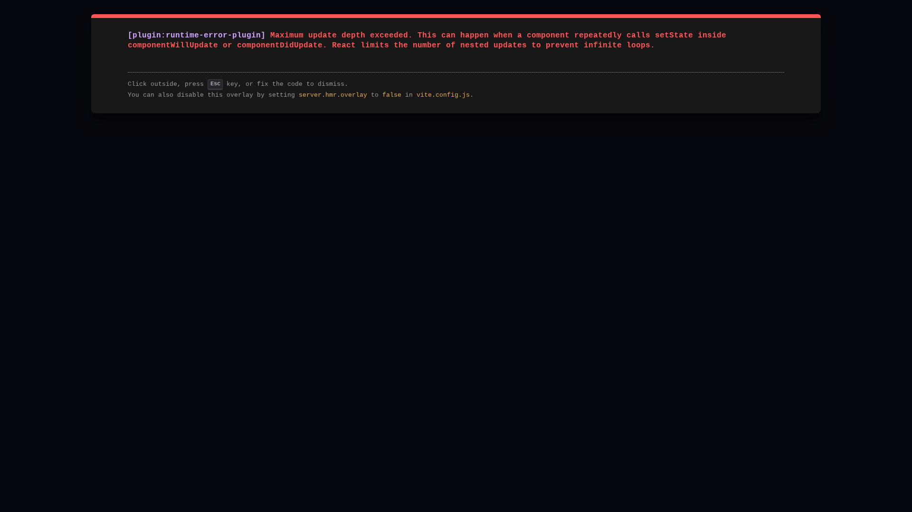
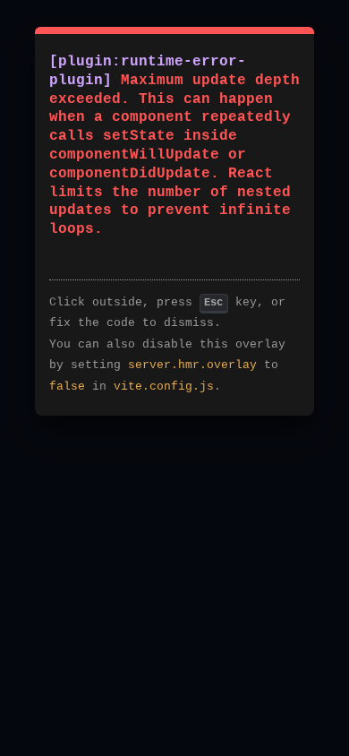

# Kastor Data Academy - Marketing Assets

This directory contains marketing assets for landing pages, social media, and promotional materials.

## 📸 Screenshots

All screenshots are captured at 1920x1080 (desktop) and 390x844 (mobile) resolution for optimal quality.

### Desktop Screenshots

| File | Description | Use Case |
|------|-------------|----------|
| `01-hero-dashboard.png` | Main dashboard view | Hero section, above-the-fold |
| `02-chat-view.png` | Chat interface with Kastor | Feature showcase |
| `03-data-view.png` | Data analysis view | Feature showcase |
| `04-files-view.png` | Evidence files browser | Feature showcase |
| `05-team-view.png` | Character/team profiles | Feature showcase |

### Mobile Screenshots

| File | Description | Use Case |
|------|-------------|----------|
| `06-mobile-hero.png` | Mobile landing page | Mobile hero, app store listings |
| `07-mobile-chat.png` | Mobile chat interface | Mobile feature showcase |

## 🎬 Demo Videos

_Note: Video files are not included in git due to size. Please record them manually or use screen recording tools._

### Recommended Video Content

1. **Full Demo (60-90s)**
   - Landing page → Start game
   - Navigate through all tabs (Chat, Data, Files, Team)
   - Show choice selection and evidence collection
   - Settings modal with theme toggle

2. **Quick Feature Showcase (30s)**
   - Rapid overview of each tab
   - Show key interactions

### Tools for Video Recording

- **OBS Studio**: Free, professional screen recording
- **Loom**: Quick web-based recording with narration
- **QuickTime** (Mac): Built-in screen recording
- **Xbox Game Bar** (Windows): Built-in screen recording (Win+G)

## 📐 Recommended Dimensions

### Web

- **Hero Image**: 1920x1080 (16:9)
- **Feature Cards**: 800x600 or 1:1 square crop
- **Social Media**:
  - Twitter: 1200x675
  - Facebook: 1200x630
  - LinkedIn: 1200x627

### Mobile/App Stores

- **iOS App Store**: 1284x2778 (iPhone 13 Pro Max)
- **Google Play Store**: 1080x1920 (Portrait)
- **Feature Graphic**: 1024x500

## 🚀 Usage Guidelines

### Landing Page

```html
<!-- Hero Section -->


<!-- Features Grid -->
<div class="features">
  
  
  
  
</div>

<!-- Mobile Showcase -->

```

### Social Media

Use screenshot crops with overlay text highlighting key features:
- "🕵️ Solve cyber crimes with AI"
- "📊 Analyze data like a detective"
- "📱 Learn on any device"

## 🎨 Branding

### Colors (from app theme)

- Primary: `#2196F3` (Blue)
- Secondary: `#FF9800` (Orange)
- Success: `#4CAF50` (Green)
- Danger: `#F44336` (Red)
- Dark: `#1E1E1E`

### Fonts

- Headings: `'Inter', sans-serif`
- Body: `'Noto Sans KR', sans-serif`
- Code: `'Fira Code', monospace`

## 📝 Copy Suggestions

### Taglines

- "Detective Training Meets Data Science"
- "Learn Cybersecurity Through Interactive Investigation"
- "Your AI Partner in Cyber Crime Investigation"

### Feature Highlights

- 💬 **Interactive Chat**: Chat with Kastor, your AI detective partner
- 📊 **Data Analysis**: Analyze logs, find patterns, solve puzzles
- 🗂️ **Evidence Management**: Collect and review digital evidence
- 👥 **Character Profiles**: Track suspects and build relationships

### Call to Actions

- "Start Investigation"
- "Join the Academy"
- "Become a Cyber Detective"

## 🔄 Regenerating Assets

To regenerate screenshots:

```bash
# Start the dev server
npm run dev

# In another terminal, run screenshot capture
npx playwright test e2e/capture-screenshots.spec.ts

# Screenshots will be saved to marketing/screenshots/
```

To capture demo videos manually:
1. Start the app: `npm run dev`
2. Open browser to `http://localhost:5000`
3. Use screen recording tool (OBS, Loom, etc.)
4. Follow the user flow in `/e2e/capture-demo-video.spec.ts`

## 📦 Asset Optimization

Before using in production:

```bash
# Optimize PNGs
pngquant screenshots/*.png --ext .png --force

# Or use ImageOptim (Mac) / TinyPNG (Web)
# Target: < 200KB per image
```

## 📄 License

These marketing assets are part of the Kastor Data Academy project.
Please maintain attribution when using externally.

---

**Last Updated**: 2025-11-13
**Asset Version**: 1.0.0
